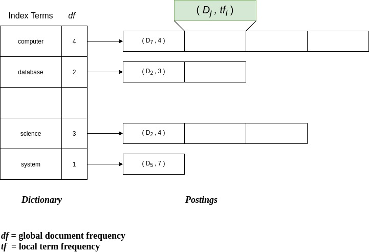

# engine-vector-indexing-service

[](https://travis-ci.org/badges/badgerbadgerbadger) [](https://coveralls.io/r/badges/badgerbadgerbadger) [](http://badges.mit-license.org) 

## Architecture


## Key Algorithms

### Inverted Indexing



### TF-IDF and Similarity Computation

## Get Started

### Prerequisites

* OS: Linux
* Golang: v1.12+

### Installation

#### Clone

* Clone this repo to your local machine using https://github.com/amazingchow/engine-vector-space-search-service.git.

#### Setup

```shell
# build the binary
make build

# start the service
./engine-vector-space-search-service
```

#### Example

## Documentation

## References

* [Design and Implementation of a Search Engine using Vector Space and PageRank](https://guangchun.files.wordpress.com/2012/05/searchenginereport.pdf)
* [A Vector Space Model for Automatic Indexing](https://dl.acm.org/doi/pdf/10.1145/361219.361220?download=true)
* [Inverted Index Implementation](https://is.muni.cz/th/hsr4u/thesis.pdf)

## Contributing

### Step 1

* 🍴 Fork this repo!

### Step 2

* 🔨 HACK AWAY!

### Step 3

* 🔃 Create a new PR using https://github.com/amazingchow/engine-vector-space-search-service/compare!

## FAQ

* refer to [FAQ](FAQ.md).

## Support

* Reach out to me at <jianzhou42@163.com>.

## License

* This project is licensed under the MIT License - see the **[MIT license](http://opensource.org/licenses/mit-license.php)** for details.
